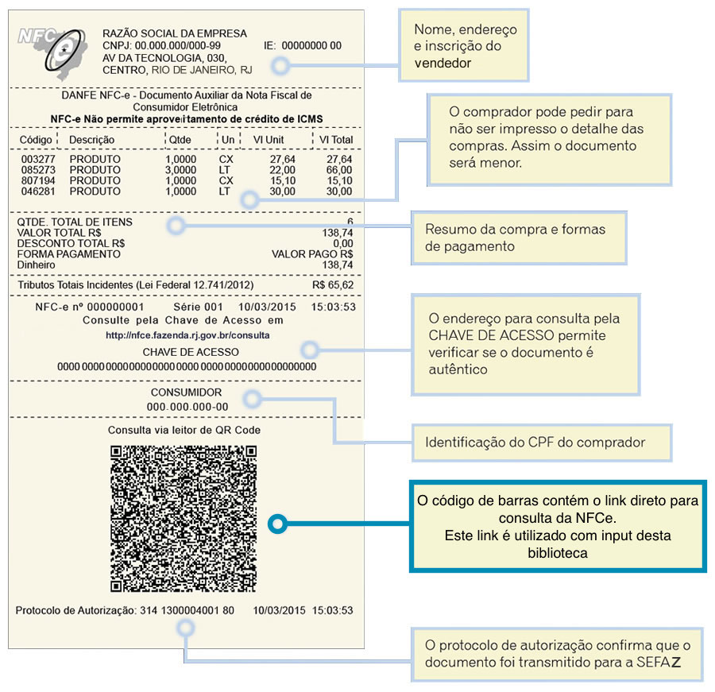

#  [NFE Biblioteca](http://thiagofelix.github.io/nfe-biblioteca)

[![semantic-release][semantic-image] ][semantic-url]  
  

Biblioteca em javascript para carregar dados sobre Nota Fiscal de Consumidor
Eletrônica através do QR Code exibido no DANFE.

</img> 

### Objetivo
Objetivo desta biblioteca é tornar possível adquirir informações sobre as NFCe
de maneira programática assim como apresenta-las de forma customizada. 
Atualmente o único jeito de ver informações da NFCe é através dos sites individuais de cada estado.

### Estados Suportados
Cada estado opera de maneira independete em sites individuais, como estes portais não expõe uma API para consulta das notas
existe um esforço em adicionar suporte para estes diversos sites.

* Parana: http://dfeportal.fazenda.pr.gov.br
* Rio Grande do Sul: http://sefaz.rs.gov.br

*Licença: MIT*
